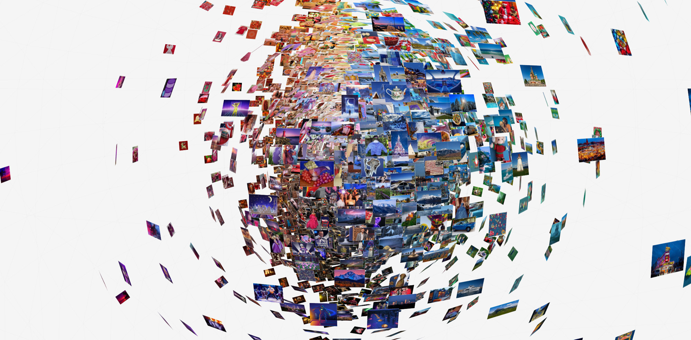

# LAION-Aesthetics V1 · Minified 10K

Gaëtan Robillard, 2023-2026.

This repository, along with the included notebook, provides a method for extracting a 10,000-image subset from the LAION-Aesthetics V1 dataset. The selected images are then downloaded and made available in the `/images` folder. Its primary goal is to give students and researchers access to a manageable portion of the LAION dataset for educational purposes and to support research into AI aesthetics and training data composition.

Laion-aesthetic contains 120M aesthetic samples (score > 7). Details at https://github.com/LAION-AI/laion-datasets/blob/main/laion-aesthetic.md

## Color Data Sphere

Generative image models are trained on billions of images, yet that data is rarely public or easy to examine. The Color Data Sphere turns that opacity into an exercise in seeing. We start with LAION Aesthetics Minified 10K, a 10,000-image subset drawn from LAION-Aesthetics V1, and we then map those images onto a color sphere, a visual primitive derived from color theory that turns unstructured data into a navigable space for inquiry. Built for the classroom, it gives AI and data design students a hands-on way to see what generative models learn from, and opens new avenues for research in both training data and generative media.

See: https://app.asc-ets.org/color-data-sphere

Students: Department of Design @The Ohio State University, IMAC @Université Gustave Eiffel and RVJV @ESGI Paris.

Technology Stack: interactive web-based application based on Three.js, data sourced from LAION-Aesthetics V1, screened for safety, used for non-commercial education and research.

## Note on Data Safety

In 2024, the LAION dataset was re-released as Re-LAION-5B [^1]. The LAION Aesthetics 10K subset we are using dates from 2023, the year before Re-LAION-5B was published to address concerns about suspected harmful content.

The Aesthetics dataset from which the 10K subset was derived in 2023 is itself already a filtered dataset from pre 2024 LAION-5B. To ensure complete safety, we screened our 10K subset, manually re-edited it, and updated the image folders accordingly. To reprocess the 10k subset from Re-LAION-5B/Aesthetics V1, download parquet file from huggingface: https://huggingface.co/datasets/laion/laion2B-en-aesthetic and use our `read` method in LAION-Aesthetics V1 Minified 10K.

Robillard Studio+Lab is committed to the ethical study of generative AI within a safe environment.

[^1]: See "Releasing Re-LAION-5B: transparent iteration on LAION-5B with additional safety fixes," LAION, https://laion.ai/blog/relaion-5b/.

## Additional Scripts

- `analysis.py` — reads images from a chosen folder (`images`, ...), set via `IMAGE_DIR` at the top of the script) and computes per-image stats (dimensions, aspect ratio, and mean/median hue, saturation, value). Results are written to `data/data.csv`.
- `resize.py` — resizes every image in `images/` to fit within a bounding box (preserving aspect ratio, no upscaling) and writes the results to a size-specific output folder (`images_720p/` or `images_480p/`). The target size is set via the `TARGET` variable at the top of the script (`"720p"` for a 1280x720 box, `"480p"` for an 854x480 box). Images already at or below the target height are copied through unresized, so the output folder always has the same image list as `images/`.

## Folders

- `images/` — original downloaded images (source of truth, untouched by the scripts).
- `data/` — CSV output generated by `analysis.py`.

Team: Gaëtan Robillard, Megan Azzolina (The Ohio State University)  
Acknowledgment: Romain Beaumont (Google DeepMind, LAION)